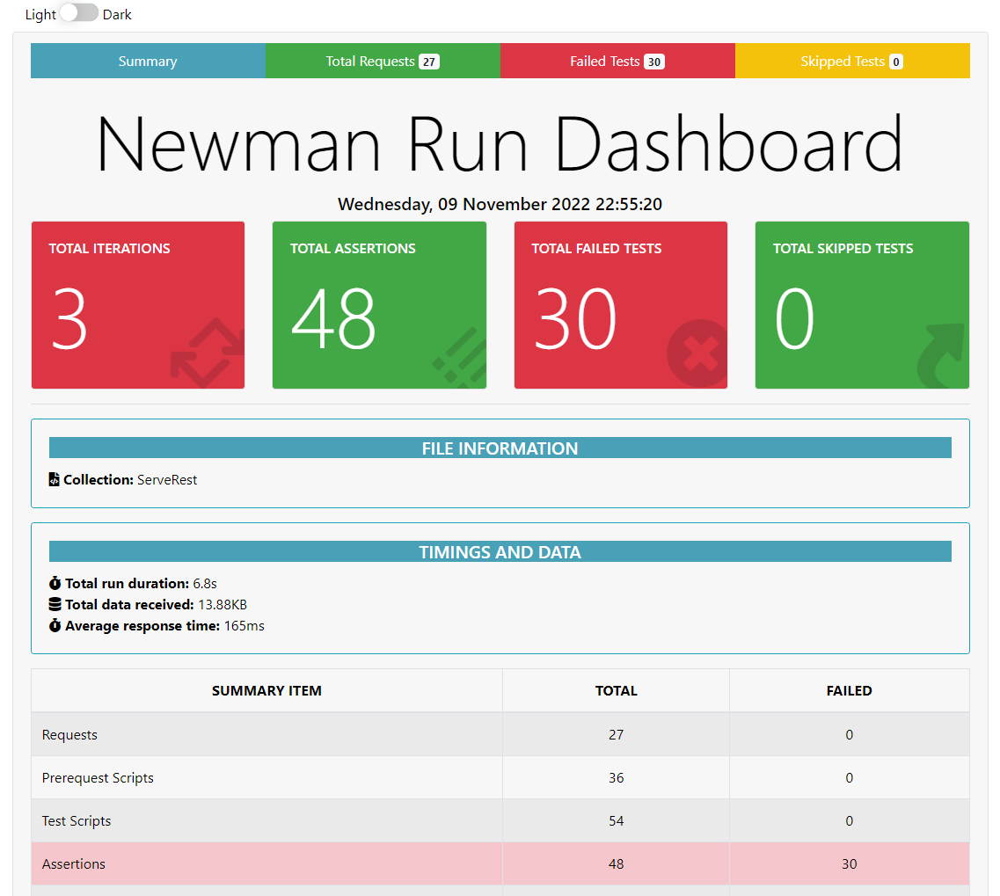

<h1 align="center">Testes com o postman e Newman HTMEXTRA</h1>

<p align="center"></p>

---

## Configurando o Ambiente :gear

- [Documentação Newman](https://www.npmjs.com/package/newman)
- [Documentação Newman HTML Extra](https://www.npmjs.com/package/newman-reporter-htmlextra)

### Requisitos para instalação

- [Node.js](https://nodejs.org/en/)
- [Java 8 ou superrior caso use o Allure Report](https://javadl.oracle.com/webapps/download/AutoDL?BundleId=244036_89d678f2be164786b292527658ca1605)

### Instalação do NPM e instalação do Cypress

Na pasta do projeto abra o terminal ou no VSCode use o Ctrl + ' (aspas simples), e digite os comandos abaixo:

```shell
npm i newman -g
npm i newman-reporter-htmlextra -g
```

### Comandos para executar os testes :gear

```shell
   newman run ServeRest.postman_collection.json -n 3 -r htmlextra --insecure --reporter-htmlextra-export ./newman/report.html
```
